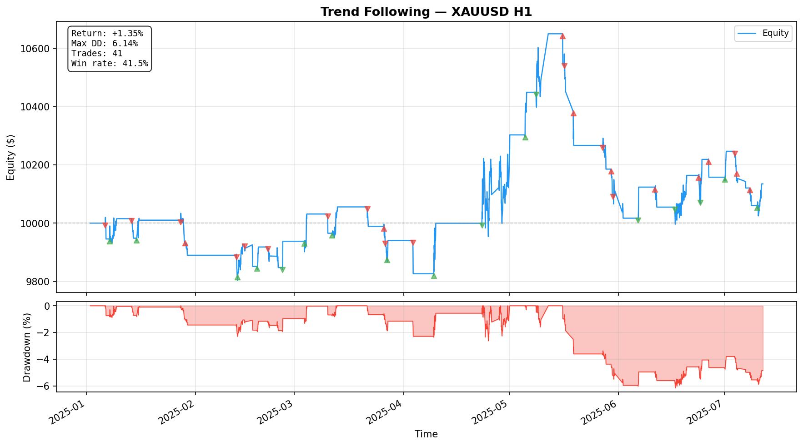

# Backtesting Engine 2.0

[](https://github.com/lucas-guerin-44/backtesting-engine/actions/workflows/test.yml)

A multi-asset, event-driven backtesting engine for evaluating trading strategies on historical OHLC data. Supports single-asset and portfolio-level backtesting with cross-asset allocation, regime detection, Bayesian optimization, and walk-forward validation.

Built with Python. Data sourced from [lucas-guerin-44/datalake-api](https://github.com/lucas-guerin-44/datalake-api).


*Equity curves for all four strategies on XAUUSD H1 with 5bps commission and 2bps slippage.*

## What This Does

Define trading strategies as Python classes, run them against historical price data — individually or as a multi-asset portfolio — and analyze the results.

**Single-asset backtesting:**
- Event-driven and vectorized execution engines
- Gap-aware stop losses (fills at open price when price gaps past stop)
- Configurable slippage, commission, leverage, and margin with automatic margin-call liquidation
- OHLC data validation (9 checks for data quality)
- Statistical significance testing (bootstrap CI, permutation test, Deflated Sharpe Ratio)

**Multi-asset portfolio backtesting:**
- Run different strategies per asset class with shared cash and risk management
- Four allocation schemes: equal weight, risk parity, correlation-aware, regime-aware
- Automatic timestamp alignment across assets with different trading hours
- Portfolio-level Bayesian optimization and walk-forward validation

## Architecture

```
┌─────────────────────────────────────────────────────┐
│  frontend.py (Streamlit Dashboard)                  │
│  api.py      (FastAPI REST API)                     │
│  examples/demo.py          (single-asset demo)      │
│  examples/portfolio_demo.py (multi-asset demo)      │
├─────────────────────────────────────────────────────┤
│  optimizer.py           ← Bayesian + walk-forward   │
│  portfolio_optimizer.py ← multi-asset optimization  │
│  results_db.py          ← SQLite persistence        │
├─────────────────────────────────────────────────────┤
│  strategy_registry.py                               │
│  strategies.py (4 strategy implementations)         │
├─────────────────────────────────────────────────────┤
│  backtesting/                                       │
│    backtest.py           ← event-driven engine      │
│    portfolio_backtest.py ← multi-asset engine       │
│    allocation.py         ← 4 allocation schemes     │
│    vectorized.py         ← numpy engine             │
│    broker.py             ← trade execution          │
│    portfolio.py          ← equity, drawdown, margin │
│    indicators.py         ← O(1) incremental + vec   │
│    statistics.py         ← bootstrap, DSR, perm     │
│    data.py               ← OHLC validation          │
│    plot.py               ← equity + drawdown charts │
│    strategy.py           ← abstract base class      │
│    types.py              ← Bar, Trade dataclasses   │
├─────────────────────────────────────────────────────┤
│  utils.py  (data fetching, Sharpe ratio, etc.)      │
│  config.py (env-based configuration)                │
└─────────────────────────────────────────────────────┘
```

**Data flow:** Strategies extend `Strategy` and implement `on_bar(i, bar, cash) -> Optional[Trade]`. The `Backtester` iterates over OHLC bars, delegates exit execution to the `Broker` (gap-aware stops, take-profits), asks the strategy for entry signals, and tracks equity via the `Portfolio`. The `PortfolioBacktester` extends this to multiple assets with shared cash, allocation weights, and cross-asset risk management.

## Included Strategies

| Strategy | Thesis | Description |
|---|---|---|
| **Trend Following** | Trend | Dual-EMA crossover with ATR stops. Managed-futures workhorse. |
| **Mean Reversion** | Mean Rev | Bollinger Band + RSI at extremes, targeting the middle band. |
| **Momentum** | Momentum | N-bar rate-of-change breakout. Based on Jegadeesh & Titman (1993). |
| **Donchian Breakout** | Breakout | Donchian channel breakout (Turtle Trading, Richard Dennis). |

All strategies share a common risk model:
- **ATR-based position sizing**: risk a fixed fraction of equity per trade (default 2%)
- **Drawdown-scaled sizing**: position size scales down linearly as drawdown deepens
- **Circuit breaker**: halts all new entries when drawdown exceeds a threshold (default 15%)
- **Cooldown**: minimum bars between trades to prevent overtrading

## Multi-Asset Portfolio Backtesting


*8 instruments (XAUUSD, EURUSD, BTCUSD, SPX500, NDX100, GER40, GBPUSD, USOUSD) on D1 with mixed strategies per asset class.*

The `PortfolioBacktester` runs multiple strategies on multiple assets with shared cash and risk management.

### Allocation schemes

| Scheme | Method | Description |
|---|---|---|
| `EqualWeightAllocator` | 1/N | Each asset gets equal capital allocation |
| `RiskParityAllocator` | Inverse vol | Weight inversely by rolling volatility — equal risk contribution |
| `CorrelationAwareAllocator` | Risk parity + corr | Reduce weight for correlated assets, increase for uncorrelated |
| `RegimeAllocator` | Vol regime | Shift weight between trend and mean-reversion assets based on rolling volatility regime |

### Usage

```python
from backtesting.portfolio_backtest import PortfolioBacktester
from backtesting.allocation import RiskParityAllocator
from strategies import TrendFollowingStrategy, MeanReversionStrategy

pbt = PortfolioBacktester(
    dataframes={"XAUUSD": df_gold, "EURUSD": df_eur, "BTCUSD": df_btc},
    strategies={
        "XAUUSD": TrendFollowingStrategy(),
        "EURUSD": MeanReversionStrategy(),
        "BTCUSD": TrendFollowingStrategy(),
    },
    allocator=RiskParityAllocator(),
    starting_cash=100_000,
    commission_bps=5.0,
    slippage_bps=2.0,
    rebalance_frequency=500,  # Recompute weights every 500 bars
)

result = pbt.run()
# result.equity_curve        — combined portfolio equity (np.ndarray)
# result.per_asset_equity    — per-asset P&L contribution
# result.per_asset_trades    — trades grouped by symbol
# result.allocation_history  — weight snapshots over time
```

Assets with different timestamps are automatically aligned (union + forward-fill). Strategies are only called on bars where real market data exists.

### Portfolio risk limits

Enforce portfolio-level constraints that are checked before every trade entry:

```python
from backtesting.portfolio_backtest import RiskLimits

pbt = PortfolioBacktester(
    dataframes, strategies,
    risk_limits=RiskLimits(
        max_gross_exposure=1.0,    # Total |notional| <= 100% of equity
        max_net_exposure=0.80,     # |long - short| <= 80% of equity
        max_single_asset=0.25,     # No asset > 25% of equity
        max_open_positions=6,      # Max 6 assets with open positions
    ),
)
```

Trades that would breach any limit are silently skipped. The Broker's buying power check still applies as a secondary guard.

### Regime-aware allocation

The `RegimeAllocator` measures cross-asset rolling volatility percentiles to detect market regime, then shifts capital toward strategies that suit the current environment:

```python
from backtesting.allocation import RegimeAllocator

allocator = RegimeAllocator(
    trend_symbols={"XAUUSD", "BTCUSD", "SPX500"},    # Get more weight in high-vol
    reversion_symbols={"EURUSD", "GBPUSD"},            # Get more weight in low-vol
    vol_lookback=200,       # Short window for current vol
    vol_history=5000,       # Long window for percentile baseline
    vol_threshold_pct=50,   # Above = trending, below = ranging
    regime_boost=2.0,       # Multiplier for favored group
)
```

### Portfolio optimizer

Optimizes per-asset strategy parameters (and optionally allocation weights) at the portfolio level:

```python
from portfolio_optimizer import StrategyConfig, portfolio_optimize, portfolio_walk_forward

configs = {
    "XAUUSD": StrategyConfig(TrendFollowingStrategy, {"fast_period": (10, 40), "slow_period": (30, 100)}),
    "EURUSD": StrategyConfig(MeanReversionStrategy, {"bb_period": (10, 30), "rsi_period": (7, 21)}),
}

result = portfolio_optimize(configs, dataframes, n_trials=50, objective="sharpe")
wf = portfolio_walk_forward(configs, dataframes, n_splits=3, n_trials=30)
```

See `examples/portfolio_demo.py` for a full end-to-end demo with 8 instruments.

## Setup

### Prerequisites

- Python 3.11+
- An OHLC data source — built to work with [lucas-guerin-44/datalake-api](https://github.com/lucas-guerin-44/datalake-api) (cursor-paginated), or local CSV files in `ohlc_data/`

### Installation

```bash
python -m venv venv
source venv/bin/activate  # Windows: venv\Scripts\activate
pip install -r requirements.txt
```

### Configuration

Copy the example environment file and edit as needed:

```bash
cp .env.example .env
```

| Variable | Default | Description |
|---|---|---|
| `DATALAKE_URL` | `http://127.0.0.1:8008` | OHLC datalake API endpoint |
| `LOCAL_API_URL` | `http://127.0.0.1:8001` | Backtesting API URL |
| `LOCAL_API_PORT` | `8001` | Port for the FastAPI server |
| `AI_ANALYST` | `false` | Enable local LLM post-backtest analysis (requires [Ollama](https://ollama.com)) |
| `AI_MODEL` | `llama3.2:3b` | Ollama model to use for analysis |
| `OLLAMA_URL` | `http://127.0.0.1:11434` | Ollama API endpoint |

### Quick Start

D1 (daily) OHLC data is included for 8 instruments: XAUUSD, EURUSD, BTCUSD, SPX500, NDX100, GER40, GBPUSD, USOUSD. Both demos work out of the box.

Single-asset demo (backtests all strategies, optimizes, validates, runs statistical tests):
```bash
python examples/demo.py
```

Multi-asset portfolio demo (8 instruments, 4 allocation schemes, portfolio optimization, walk-forward):
```bash
python examples/portfolio_demo.py
```

### Running

**API server:**
```bash
make backend
# or: uvicorn api:app --reload --port 8001
```

**Dashboard:**
```bash
make frontend
# or: streamlit run frontend.py
```

**Tests:**
```bash
python -m pytest tests/ -v
```

## Execution Model

The `Backtester` processes each bar in this order:

1. **Stop-loss exits** (via Broker) - gap-aware: if bar opens past stop, fills at open price (worse), not the stop level
2. **Take-profit exits** (via Broker)
3. **Strategy signal** - `on_bar()` receives available cash after accounting for open positions
4. **Entry execution** (via Broker) - with leverage/margin checks, slippage, commission
5. **Portfolio update** - equity curve, drawdown tracking, margin call check

The `PortfolioBacktester` extends this: exits for ALL assets are processed before any new entries, preventing cash race conditions across instruments.

When both stop and take-profit are hit in the same bar, `execution_priority` determines which fires first (default: `"stop_first"` for conservative estimates).

## Data Validation

All data is validated before backtesting via `validate_ohlc()`:

| Check | Severity | What it catches |
|---|---|---|
| Required columns | ERROR | Missing open/high/low/close |
| Numeric types | ERROR | String or object columns in OHLC |
| NaN / Inf | ERROR | Missing or infinite values |
| OHLC consistency | ERROR | high < low, high < close, etc. |
| Duplicate timestamps | ERROR | Same timestamp appearing twice |
| Monotonic timestamps | ERROR | Out-of-order bars |
| Missing bars | WARNING | Gaps in expected frequency |
| Zero/negative prices | WARNING | Suspicious price values |
| Extreme moves | WARNING | >50% single-bar moves |

## Data Format

The engine expects OHLC data with these columns:

| Column | Type | Description |
|---|---|---|
| `timestamp` | datetime | Bar timestamp (UTC) |
| `open` | float | Open price |
| `high` | float | High price |
| `low` | float | Low price |
| `close` | float | Close price |

Data is fetched from the datalake API with automatic cursor-based pagination and cached locally in `ohlc_data/` as `{INSTRUMENT}_{TIMEFRAME}.csv`.

## API Endpoints

| Method | Path | Description |
|---|---|---|
| `GET` | `/instruments` | List available instruments |
| `GET` | `/timeframes?instrument=X` | List timeframes for an instrument |
| `GET` | `/param_space/{strategy}` | Get parameter schema for a strategy |
| `POST` | `/backtest/run` | Run a backtest, returns metrics + equity curve + trades |

## Writing a New Strategy

```python
from typing import Optional
from backtesting.strategy import Strategy
from backtesting.types import Bar, Trade

class MyStrategy(Strategy):
    def __init__(self, lookback: int = 20):
        self.lookback = lookback

    def on_bar(self, i: int, bar: Bar, cash: float) -> Optional[Trade]:
        # Return a Trade to enter, or None to skip
        return Trade(
            entry_bar=bar,
            side=1,          # +1 long, -1 short
            size=cash * 0.1 / bar.close,
            entry_price=bar.close,
            stop_price=bar.close * 0.98,
            take_profit=bar.close * 1.04,
        )
```

Register it in `strategy_registry.py` to make it available in the API and dashboard.

## Parameter Optimizer

`optimizer.py` provides Bayesian parameter search (Optuna TPE) with walk-forward validation and parallel execution.

### How it works

The optimizer runs the Backtester internally for each trial — you don't need to run the optimizer and then re-run the backtest separately. Each trial constructs a strategy with sampled parameters, runs a full backtest, and scores the result. The best parameters and their backtest results are returned together.

### Objective functions

You choose what the optimizer maximizes:

| Objective | Formula | Best for |
|---|---|---|
| `"sharpe"` | mean(excess returns) / std(returns), annualized | General-purpose risk-adjusted performance |
| `"return"` | (final equity - initial) / initial | Maximizing raw P&L (ignores risk) |
| `"calmar"` | total return / max drawdown | Prioritizing drawdown protection |
| `"sortino"` | mean(returns) / std(negative returns), annualized | Penalizing downside volatility only |

### Single-period optimization

Fast parameter search over one date range. Good for exploration, but the results are overfit — the optimizer will find parameters that look great on the data it trained on.

```python
from optimizer import optimize
from strategies import TrendFollowingStrategy

result = optimize(
    strategy_cls=TrendFollowingStrategy,
    param_space={
        "fast_period": (5, 40),       # int range
        "slow_period": (20, 100),     # int range
        "atr_stop_mult": (1.0, 5.0),  # float range
        "risk_per_trade": (0.01, 0.05),
    },
    df=df,
    n_trials=100,
    objective="sharpe",            # or "return", "calmar", "sortino"
    n_jobs=-1,                     # parallel trials (all CPU cores)
    commission_bps=5.0,
    slippage_bps=2.0,
)

print(result.best_params)   # {'fast_period': 39, 'slow_period': 88, ...}
print(result.best_score)    # 0.6492
print(result.all_trials)    # DataFrame of all 100 trials with params + scores
```

### Walk-forward validation

The only honest way to evaluate parameter tuning. Splits data into rolling train/test windows:

1. **Train**: optimize parameters on the training portion (in-sample)
2. **Test**: evaluate those parameters on unseen data (out-of-sample)

The gap between in-sample and out-of-sample performance is the **degradation** — a direct measure of overfitting.

```python
from optimizer import walk_forward

wf = walk_forward(
    strategy_cls=TrendFollowingStrategy,
    param_space={"fast_period": (5, 40), "slow_period": (20, 100)},
    df=df,
    n_splits=4,         # 4 rolling windows
    train_ratio=0.7,    # 70% train, 30% test per window
    n_trials=50,        # Optuna trials per training window
    objective="sharpe",
    n_jobs=-1,           # parallel within each split
)

print(wf.summary)               # DataFrame with IS/OOS scores per split
print(wf.in_sample_mean)        # Average in-sample Sharpe
print(wf.out_of_sample_mean)    # Average out-of-sample Sharpe (the real number)
print(wf.degradation)           # IS - OOS (high = overfitting)
```

## Statistical Significance

Three tests to determine if backtest results are real or noise:

| Test | Question | Method |
|---|---|---|
| **Bootstrap CI** | "Is the Sharpe statistically different from zero?" | Resample returns 10k times, report 95% confidence interval |
| **Permutation test** | "Could random trades have produced this Sharpe?" | Shuffle trade PnLs, build null distribution, report p-value |
| **Deflated Sharpe** | "Is this Sharpe still significant after testing N param combos?" | Bailey & Lopez de Prado (2014) correction for multiple testing |

```python
from backtesting.statistics import compute_statistical_report

report = compute_statistical_report(equity_curve, trades, n_trials_tested=50)
print(report)
# Bootstrap CI:     Sharpe: 0.42  CI [0.08, 0.79] (95%) — SIGNIFICANT
# Permutation test: Sharpe: 0.42  p-value: 0.012  percentile: 98.8th — SIGNIFICANT
# Deflated Sharpe:  Observed SR: 0.42  Deflated SR: 0.18  (p=0.04, 50 trials) — SURVIVES deflation
```

## Results Database

SQLite-backed persistence for backtest runs and optimization results.

```python
from results_db import ResultsDB

with ResultsDB("results.db") as db:
    # Save a backtest run
    run_id = db.save_run("TrendFollowing", params, equity_curve, trades)

    # Query stored runs
    df = db.query_runs(min_sharpe=0.3, strategy="TrendFollowing")

    # Save walk-forward results
    db.save_walk_forward(wf_result, "TrendFollowing")
```

CLI access:
```bash
python -m results_db query --min-sharpe 0.3 --strategy "Trend Following"
python -m results_db get 42
```

## Visualization



```python
from backtesting.plot import plot_backtest, plot_strategy_comparison

# Single strategy equity curve with drawdown
plot_backtest(equity_curve, trades, timestamps=list(df.index),
              title="Trend Following — XAUUSD H1", save_path="chart.png")

# Compare multiple strategies
plot_strategy_comparison({
    "Trend Following": eq_trend,
    "Mean Reversion": eq_mean_rev,
    "Momentum": eq_momentum,
}, save_path="comparison.png")
```

## Performance

Two execution tiers, both pure Python (no C extensions):

| Engine | Throughput | Use case |
|---|---|---|
| Event-driven (`Backtester`) | ~300,000 bars/sec | Any strategy, complex inter-bar state allowed |
| Vectorized (`VectorizedBacktester`) | ~600,000 bars/sec | Array-expressible strategies (all 4 included) |

At vectorized speed, 1,000 Optuna trials on 3,000 bars completes in ~5 seconds.

## Testing

192 tests covering:

| Module | Tests | Coverage |
|---|---|---|
| `test_backtest.py` | 15 | Engine basics, trade execution, commission/slippage, gap-aware stops, drawdown |
| `test_broker.py` | 13 | Open/close trades, stop/TP execution, gap fills, buying power, costs |
| `test_portfolio.py` | 6 | Equity tracking, drawdown, margin call liquidation |
| `test_portfolio_backtest.py` | 32 | Multi-asset backtester, allocation schemes, regime detection, risk limits, portfolio optimizer |
| `test_data_validation.py` | 18 | OHLC validation: all 9 checks, error vs warning severity |
| `test_statistics.py` | 18 | Bootstrap CI, permutation test, Deflated Sharpe Ratio |
| `test_strategies.py` | 25 | ABC, incremental indicators, vectorized indicators, risk sizing, drawdown guard, signals |
| `test_optimizer.py` | 12 | Single-period, walk-forward, parallel execution, objective functions |
| `test_results_db.py` | 15 | CRUD, query filtering, walk-forward splits, cascade delete |
| `test_vectorized.py` | 13 | Vectorized backtester, signal generators, gap-aware stops |
| `test_utils.py` | 18 | Sharpe ratio, frequency inference, sanitize, timeframe normalization |
| `test_types.py` | 5 | Bar and Trade dataclass creation |

```bash
python -m pytest tests/ -v  # 192 tests in ~2.7s
```

## AI Analyst

Optional local LLM analysis after each backtest run. Uses [Ollama](https://ollama.com) to run a small model on your machine — no API keys, no cloud, no data leaves your computer.

Enable it:
```bash
# .env
AI_ANALYST=true
AI_MODEL=llama3.2:3b   # or any Ollama model
```

The model is pulled automatically on first run. After backtests complete, the analyst prints a plain-English review covering performance, risk, overfitting signals, and concrete suggestions — referencing the actual numbers from your run.

## Known Limitations

- **Flat slippage model.** Fixed basis-point cost regardless of order size or liquidity. A production system would use a market impact model.
- **No funding costs.** No overnight financing simulation for leveraged or multi-day positions.
- **No calendar awareness.** All bars are treated as equal -- no weekends, holidays, or trading sessions.
