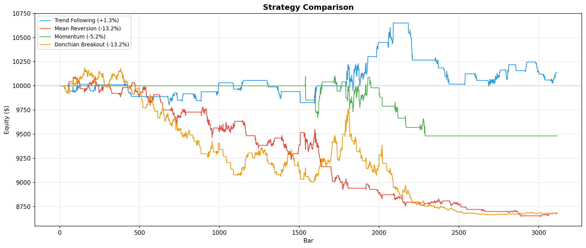
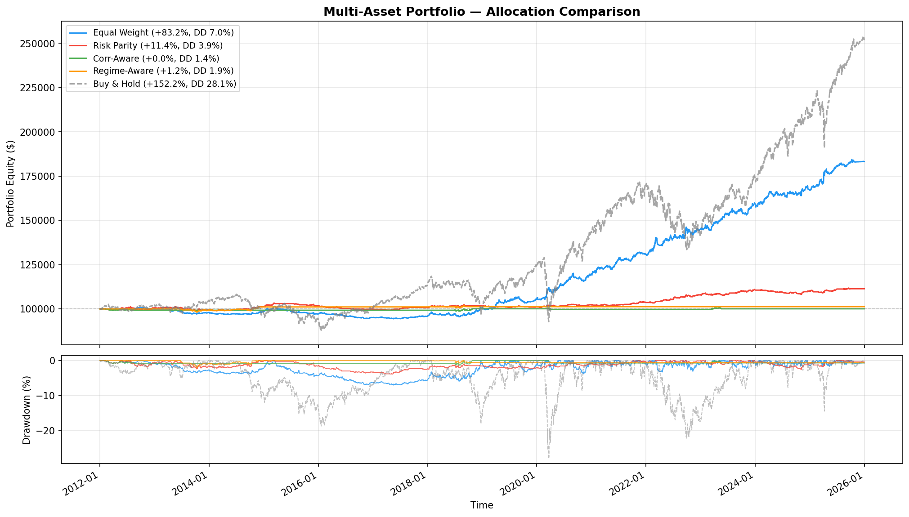

# Backtesting Engine

[](https://github.com/lucas-guerin-44/backtesting-engine/actions/workflows/test.yml)

A multi-asset, event-driven backtesting engine for evaluating trading strategies on historical OHLC and tick data. Supports portfolio-level backtesting with cross-asset allocation, Bayesian optimization, walk-forward validation, and tick-level execution simulation.

Built with Python. Data sourced from [lucas-guerin-44/datalake-api](https://github.com/lucas-guerin-44/datalake-api).


*Equity curves for all four strategies + buy & hold on XAUUSD D1 (2012-2025) with 5bps commission and 2bps slippage. See [research process](docs/research.md) for walk-forward validation results and methodology discussion.*

## Features

- **Four execution tiers**: event-driven (~300k bars/sec), vectorized (~700k bars/sec), Cython-accelerated (~27M bars/sec), and tick-level (~2.4M ticks/sec). Optional C extensions accelerate indicator computation (EMA, ATR, RSI), trade chaining, and tick stop/TP scanning. 1,000 optimizer trials in ~8s vs ~29s pure Python
- **Tick-level backtesting**: processes raw tick data, aggregates into OHLC bars at configurable timeframes, fills at next-tick price (not next-bar open), checks stops/TPs on every tick. Strategies receive dual callbacks: `on_tick()` for intra-bar logic and `on_bar()` on bar completion. Existing bar-only strategies work unchanged (default no-op `on_tick()`)
- **Gap-aware stops**: if price gaps past a stop level, fills at the open (worse price), not the stop
- **Multi-asset portfolios**: shared cash, cross-asset risk limits, 4 allocation schemes (equal weight, risk parity, correlation-aware, regime-aware)
- **Bayesian optimization**: Optuna TPE with walk-forward validation and parameter constraints
- **Statistical testing**: bootstrap CI, permutation test, Deflated Sharpe Ratio (Bailey & Lopez de Prado 2014)
- **254 tests** across 15 modules in ~4s, includes cross-engine consistency checks (event-driven vs vectorized produce equivalent results), tick-vs-bar convergence tests, walk-forward contamination regression tests (proves OOS data never leaks into training), and indicator edge-case / vectorized-vs-incremental consistency checks. Reproducible benchmark scripts in `benchmarks/`

## Architecture

```
┌─────────────────────────────────────────────────────┐
│  frontend.py (Streamlit Dashboard)                  │
│  api.py      (FastAPI REST API)                     │
│  examples/demo.py          (single-asset demo)      │
│  examples/portfolio_demo.py (multi-asset demo)      │
├─────────────────────────────────────────────────────┤
│  optimizer.py           ← Bayesian + walk-forward   │
│  portfolio_optimizer.py ← multi-asset optimization  │
│  results_db.py          ← SQLite persistence        │
├─────────────────────────────────────────────────────┤
│  strategy_registry.py                               │
│  strategies/             (4 strategy implementations)│
│    trend_following.py    ← EMA crossover + ATR stops │
│    mean_reversion.py     ← Bollinger + RSI           │
│    momentum.py           ← rate-of-change breakout   │
│    donchian.py           ← channel breakout          │
│    base.py               ← shared sizing + filters   │
├─────────────────────────────────────────────────────┤
│  backtesting/                                       │
│    backtest.py           ← event-driven engine      │
│    tick_backtest.py      ← tick-level engine        │
│    portfolio_backtest.py ← multi-asset engine       │
│    allocation.py         ← 4 allocation schemes     │
│    vectorized.py         ← numpy engine             │
│    _core.pyx             ← Cython C extension (opt) │
│    _tick_core.pyx        ← Cython tick extension    │
│    tick.py               ← Tick type + aggregator   │
│    broker.py             ← trade execution          │
│    portfolio.py          ← equity, drawdown, margin │
│    indicators.py         ← O(1) incremental + vec   │
│    statistics.py         ← Sharpe, bootstrap, DSR   │
│    data.py               ← OHLC + tick validation   │
│    plot.py               ← equity + drawdown charts │
│    strategy.py           ← abstract base class      │
│    types.py              ← Bar, Trade, BacktestConfig│
├─────────────────────────────────────────────────────┤
│  utils.py  (data fetching, tick loading, freq inf.) │
│  config.py (env-based configuration)                │
└─────────────────────────────────────────────────────┘
```

Strategies extend `Strategy` and implement `on_bar(i, bar, equity) -> Optional[Trade]`. Optionally override `on_tick()` for intra-bar logic (tick-level strategies) — the default is a no-op so existing strategies work unchanged. The `Backtester` delegates execution to the `Broker` (gap-aware stops, slippage, commission) and tracking to the `Portfolio` (equity, drawdown, margin calls). The `TickBacktester` processes raw ticks, aggregates into bars via `TickAggregator`, and fills at tick-level granularity. The `PortfolioBacktester` extends this to multiple assets with shared cash, allocation weights, and cross-asset risk management, exits for all assets are processed before any new entries, preventing cash race conditions.

## Quick Start

```bash
python -m venv venv && source venv/bin/activate  # Windows: venv\Scripts\activate
pip install -r requirements.txt
cp .env.example .env  # Set DATALAKE_URL
pip install cython && python setup.py build_ext --inplace  # Optional: Cython extensions for bar + tick engines
```

```bash
python examples/demo.py            # Single-asset: backtest, optimize, walk-forward, holdout, stat tests
python examples/portfolio_demo.py  # Multi-asset: 6 instruments, 4 allocators, portfolio walk-forward
```

### Docker

```bash
cp .env.example .env   # Set DATALAKE_URL
docker compose up      # API on :8001, dashboard on :8501
```

## Included Strategies

| Strategy | Description |
|---|---|
| **Trend Following** | Dual-EMA crossover with ATR trailing stops and trend re-entry |
| **Mean Reversion** | Bollinger Band + RSI at extremes, targeting the middle band |
| **Momentum** | N-bar rate-of-change breakout (Jegadeesh & Titman 1993) |
| **Donchian Breakout** | Channel breakout, Turtle Trading style (Richard Dennis) |

All strategies share: ATR-based position sizing, drawdown-scaled sizing (linear scale-down), circuit breaker (halts at configurable DD threshold), and cooldown between trades.

## Usage

### Single-asset backtest

```python
from backtesting.backtest import Backtester
from backtesting.types import BacktestConfig
from strategies import MomentumStrategy

config = BacktestConfig(starting_cash=10_000, commission_bps=5.0, slippage_bps=2.0)
bt = Backtester(df, MomentumStrategy(trend_filter_period=200), config=config, symbol="XAUUSD")
equity_curve, trades = bt.run()
```

### Tick-level backtest

```python
from utils import load_ticks
from backtesting.tick_backtest import TickBacktester
from backtesting.types import BacktestConfig
from strategies import TrendFollowingStrategy

ticks = load_ticks("tick_data/XAUUSD_TICK.csv")  # MT5 or generic CSV
config = BacktestConfig(starting_cash=10_000, commission_bps=5.0, slippage_bps=2.0)
bt = TickBacktester(ticks, TrendFollowingStrategy(), timeframe="M5", config=config, symbol="XAUUSD")
equity_curve, trades = bt.run()

# bt.bars contains the aggregated M5 bars
# bt.bar_equity_curve has one equity value per completed bar
```

Tick data is aggregated into bars at the specified timeframe. Strategies receive `on_bar()` when a bar completes and optionally `on_tick()` on every tick for intra-bar logic (limit orders, tighter stop management, microstructure signals). Fills happen at the next tick's price, stops/TPs are checked on every tick at the exact breach price.

### Multi-asset portfolio

```python
from backtesting.portfolio_backtest import PortfolioBacktester, RiskLimits
from backtesting.allocation import RiskParityAllocator
from strategies import TrendFollowingStrategy, DonchianBreakoutStrategy, MomentumStrategy

pbt = PortfolioBacktester(
    dataframes={"XAUUSD": df_gold, "EURUSD": df_eur, "NDX100": df_ndx},
    strategies={
        "XAUUSD": TrendFollowingStrategy(),
        "EURUSD": DonchianBreakoutStrategy(),
        "NDX100": MomentumStrategy(),
    },
    allocator=RiskParityAllocator(max_weight=0.30),
    config=config,
    rebalance_frequency=21,
    risk_limits=RiskLimits(max_gross_exposure=0.9, max_single_asset=0.30),
)
result = pbt.run()
```

Trades that breach risk limits are skipped and logged to `result.audit_log` with rejection reasons. Assets with different timestamps are aligned automatically (union + forward-fill).

### Optimization + walk-forward

```python
from optimizer import optimize, walk_forward

result = optimize(
    MomentumStrategy, param_space={"lookback": (5, 40), "entry_threshold": (0.01, 0.06)},
    df=df, n_trials=500, objective="sharpe",  # also: "return", "calmar", "sortino"
    engine="vectorized",  # ~3x faster than event-driven (default: "event")
)

wf = walk_forward(
    MomentumStrategy, param_space, df,
    n_splits=3, train_ratio=0.7, n_trials=200, anchored=True,
)
print(wf.degradation)  # IS - OOS: positive = overfitting, near-zero = good
```

### Writing a new strategy

```python
from backtesting.strategy import Strategy
from backtesting.types import Bar, Trade

class MyStrategy(Strategy):
    def on_bar(self, i: int, bar: Bar, equity: float):
        return Trade(entry_bar=bar, side=1, size=equity * 0.1 / bar.close,
                     entry_price=bar.close, stop_price=bar.close * 0.98,
                     take_profit=bar.close * 1.04)
```

For tick-level strategies, override `on_tick()` and/or `manage_position_tick()`:

```python
class MyTickStrategy(Strategy):
    def on_bar(self, i, bar, equity):
        ...  # Bar-level signal generation (indicators, entries)

    def on_tick(self, tick, current_bar, equity):
        ...  # Intra-bar logic (limit orders, microstructure signals)

    def manage_position_tick(self, tick, trade):
        ...  # Tick-granularity stop management (tighter trailing stops)
```

Both `on_tick()` and `manage_position_tick()` default to no-ops, so existing strategies work unchanged with `TickBacktester`.

Register in `strategy_registry.py` to expose via the API and dashboard.

## Multi-Asset Portfolio


*6 instruments on D1 (2012-2025). Equal Weight: +83% return, Sharpe 0.99, 7% max DD vs. Buy & Hold +152% with 15%+ drawdown.*

Four allocation schemes, all with optional `max_weight` capping:

| Scheme | Method |
|---|---|
| `EqualWeightAllocator` | 1/N per asset |
| `RiskParityAllocator` | Inverse rolling volatility |
| `CorrelationAwareAllocator` | Risk parity scaled by inverse pairwise correlation |
| `RegimeAllocator` | Shifts weight between trend/reversion assets based on vol regime |

## Execution Model

**Bar-level:** Each bar is processed: stop exits → TP exits → strategy signal → entry execution → portfolio update. Gap-aware: if a bar opens past a stop, the fill is at the open price (worse), not the stop level. When both stop and TP are hit in the same bar, stops fire first (conservative default).

**Tick-level:** Each tick is processed: stop/TP check at exact tick price → fill pending trades at tick price → aggregate into bar → call `on_bar()` when bar completes → call `on_tick()` for intra-bar signals. No gap logic needed — ticks are the atomic price updates. Fills happen at the next tick after a signal, not the next bar open.

## API

```bash
make backend   # uvicorn api:app --reload --port 8001
make frontend  # streamlit run frontend.py
```

| Method | Path | Description |
|---|---|---|
| `GET` | `/instruments` | List available instruments |
| `GET` | `/timeframes?instrument=X` | List timeframes for an instrument |
| `GET` | `/param_space/{strategy}` | Get parameter schema |
| `POST` | `/backtest/run` | Submit backtest, returns `task_id` for async polling |
| `POST` | `/backtest/run?sync=true` | Run backtest synchronously, returns results inline |
| `GET` | `/backtest/{task_id}` | Poll task status (`running`, `complete`, `failed`) |

Backtests run asynchronously by default (ThreadPoolExecutor, 4 workers). Submit multiple backtests and poll each independently.

## Research

See [docs/research.md](docs/research.md) for a write-up of the research process: diagnosing overfitting (insufficient data, degenerate parameters, data contamination), fixing the methodology, and understanding what the results actually show vs. what they don't.

## Known Limitations

- **Flat slippage model.** Fixed basis-point cost regardless of order size or liquidity. Tick data includes bid/ask spread which could be used for more realistic spread modeling.
- **No funding costs.** No overnight financing simulation for leveraged or multi-day positions.
- **No calendar awareness.** All bars are treated as equal, no weekends, holidays, or trading sessions.
- **Tick backtester is single-asset only.** No portfolio-level tick backtesting yet (bar-level portfolio backtester handles multi-asset).
